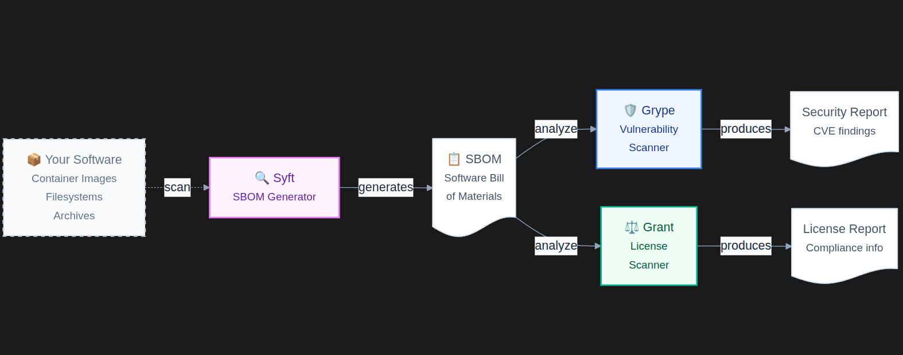

# Workflow - Anchore
## Introduction
The Anchore workflow involves multiple tools:
- [Syft](../tools/blue/syft.md)
- [Grype](../tools/blue/grype.md)
- [Grant](../tools/blue/grant.md)

With this worflow (provided by Anchore) a system, container or project can be scanned, with the following benefits:
- Dependency analysis
- License analysis

## Workflow organization

## When to include this workflow
- Set at system level, but not very recommended, as more system specific software (like Lynis) exist.
- Very useful in CI/CD pipelines (Jenkins, Bitbucket, Github...).